# 🗃️ Diagrama de Base de Datos - Healthy Life API

## 📊 Diagrama Entidad-Relación

```mermaid
erDiagram
    %% Tabla principal de usuarios
    USER {
        bigint id PK
        varchar name
        varchar email UK
        varchar password
        bigint role_id FK
    }
    
    %% Roles y permisos
    ROLE {
        bigint id PK
        varchar name UK "ENUM: USER, SUPERVISOR, ADMIN"
        text description
        boolean can_read
        boolean can_write
        boolean can_delete
    }
    
    %% Hábitos disponibles
    HABIT {
        bigint id PK
        varchar name UK
        varchar category "ENUM: PHYSICAL, MENTAL, SLEEP, DIET, PRODUCTIVITY"
        text description
    }
    
    %% Rutinas de usuario
    ROUTINE {
        bigint id PK
        bigint user_id FK
        varchar title
        varchar days_of_week "CSV: LUNES,MARTES,etc"
    }
    
    %% Actividades dentro de rutinas
    ROUTINE_ACTIVITY {
        bigint id PK
        bigint routine_id FK
        bigint habit_id FK
        integer duration "minutos"
        time target_time
        text notes
    }
    
    %% Guías y recomendaciones
    GUIDE {
        bigint id PK
        varchar title
        text content
        varchar category "ENUM: PHYSICAL, MENTAL, SLEEP, DIET, PRODUCTIVITY"
    }
    
    %% Relación Many-to-Many: Guías recomiendan hábitos
    GUIDE_RECOMMENDED_HABITS {
        bigint guide_id FK
        bigint habit_id FK
    }
    
    %% Recordatorios de usuario
    REMINDER {
        bigint id PK
        bigint user_id FK
        bigint habit_id FK
        time time
        varchar frequency "ENUM: DAILY, WEEKLY, MONTHLY"
    }
    
    %% Registro de progreso diario
    PROGRESS_LOG {
        bigint id PK
        bigint user_id FK
        bigint routine_id FK
        date date
    }
    
    %% Actividades completadas
    COMPLETED_ACTIVITY {
        bigint id PK
        bigint habit_id FK
        bigint progress_log_id FK
        datetime completed_at
        text notes
    }
    
    %% Hábitos favoritos del usuario (Many-to-Many)
    USER_FAVORITE_HABITS {
        bigint user_id FK
        bigint habit_id FK
    }
    
    %% Tokens de autenticación JWT
    AUTH_TOKEN {
        bigint id PK
        varchar token UK
        datetime expires_at
        bigint user_id FK
    }
    
    %% === RELACIONES ===
    
    %% Usuario tiene un rol
    USER ||--o{ ROLE : "has role"
    
    %% Usuario puede tener múltiples rutinas
    USER ||--o{ ROUTINE : "creates routines"
    
    %% Usuario puede tener múltiples recordatorios
    USER ||--o{ REMINDER : "sets reminders"
    
    %% Usuario puede tener múltiples logs de progreso
    USER ||--o{ PROGRESS_LOG : "tracks progress"
    
    %% Usuario puede tener múltiples tokens
    USER ||--o{ AUTH_TOKEN : "has tokens"
    
    %% Relación Many-to-Many: Usuario favoritos
    USER }|--|| USER_FAVORITE_HABITS : "favorites"
    HABIT }|--|| USER_FAVORITE_HABITS : "favorited by"
    
    %% Rutina contiene múltiples actividades
    ROUTINE ||--o{ ROUTINE_ACTIVITY : "contains activities"
    
    %% Hábito puede estar en múltiples actividades de rutina
    HABIT ||--o{ ROUTINE_ACTIVITY : "used in activities"
    
    %% Hábito puede tener múltiples recordatorios
    HABIT ||--o{ REMINDER : "has reminders"
    
    %% Rutina puede tener múltiples logs de progreso
    ROUTINE ||--o{ PROGRESS_LOG : "tracked in logs"
    
    %% Log de progreso contiene múltiples actividades completadas
    PROGRESS_LOG ||--o{ COMPLETED_ACTIVITY : "contains completed activities"
    
    %% Hábito puede estar en múltiples actividades completadas
    HABIT ||--o{ COMPLETED_ACTIVITY : "completed in activities"
    
    %% Relación Many-to-Many: Guías recomiendan hábitos
    GUIDE }|--|| GUIDE_RECOMMENDED_HABITS : "recommends"
    HABIT }|--|| GUIDE_RECOMMENDED_HABITS : "recommended in"
    
    ROUTINE_ACTIVITY {
        bigint id PK
        bigint routine_id FK
        bigint habit_id FK
        int duration
        time target_time
        text notes
    }
    
    PROGRESS_LOG {
        bigint id PK
        bigint user_id FK
        bigint routine_id FK
        date date
    }
    
    COMPLETED_ACTIVITY {
        bigint id PK
        bigint habit_id FK
        bigint progress_log_id FK
        timestamp completed_at
        text notes
    }
    
    GUIDE {
        bigint id PK
        varchar title
        text content
        varchar category "CHECK (category IN ('PHYSICAL', 'MENTAL', 'SLEEP', 'DIET'))"
    }
    
    REMINDER {
        bigint id PK
        bigint user_id FK
        bigint habit_id FK
        time time
        varchar frequency "CHECK (frequency IN ('DAILY', 'WEEKLY'))"
    }
    
    AUTH_TOKEN {
        bigint id PK
        varchar token UK
        timestamp expires_at
        bigint user_id FK
    }
    
    USER_FAVORITE_HABITS {
    bigint user_id PK, FK
    bigint habit_id PK, FK
    }
    
    GUIDE_RECOMMENDED_HABITS {
    bigint guide_id PK, FK
    bigint habit_id PK, FK
    }

    USER ||--o{ ROUTINE : "creates"
    USER ||--o{ PROGRESS_LOG : "tracks"
    USER ||--o{ REMINDER : "sets"
    USER ||--o{ AUTH_TOKEN : "authenticates_with"
    USER }o--|| ROLE : "has"
    USER ||--o{ USER_FAVORITE_HABITS : "favorites"
    
    ROUTINE ||--o{ ROUTINE_ACTIVITY : "contains"
    ROUTINE ||--o{ PROGRESS_LOG : "logged_in"
    
    HABIT ||--o{ ROUTINE_ACTIVITY : "included_in"
    HABIT ||--o{ COMPLETED_ACTIVITY : "completed_as"
    HABIT ||--o{ REMINDER : "reminded_for"
    HABIT ||--o{ USER_FAVORITE_HABITS : "favorited_by"
    HABIT ||--o{ GUIDE_RECOMMENDED_HABITS : "recommended_in"
    
    PROGRESS_LOG ||--o{ COMPLETED_ACTIVITY : "contains"
    
```



## 📈 Información del Sistema

### **🔢 Estadísticas Actuales**
- **11 Tablas principales** con relaciones complejas
- **3 Tablas de unión** para relaciones Many-to-Many
- **Soporte para 500,000+ registros** con optimizaciones de rendimiento

### **🔧 Características Técnicas**
- **Base de datos**: MariaDB 11.0
- **ORM**: JPA/Hibernate con Lazy Loading
- **Paginación**: Implementada en todas las consultas principales
- **Autenticación**: JWT con tokens de sesión
- **Optimizaciones**: Batch processing (1000 registros por lote)

### **🏗️ Arquitectura de Datos**

#### **Entidades Centrales:**
1. **User**: Usuario del sistema con roles y permisos
2. **Habit**: Hábitos disponibles categorizados
3. **Routine**: Rutinas personalizadas por usuario
4. **ProgressLog**: Seguimiento diario del progreso

#### **Entidades de Soporte:**
- **Role**: Sistema de permisos granular
- **Guide**: Contenido educativo y recomendaciones
- **Reminder**: Sistema de notificaciones
- **AuthToken**: Gestión de sesiones JWT

#### **Relaciones Complejas:**
- **Many-to-Many**: Usuario ↔ Hábitos favoritos
- **Many-to-Many**: Guías ↔ Hábitos recomendados
- **One-to-Many**: Cascada completa para rutinas y actividades

### **⚡ Optimizaciones Implementadas**

```properties
# Configuración de rendimiento en application.properties
spring.jpa.properties.hibernate.jdbc.batch_size=1000
spring.jpa.properties.hibernate.order_inserts=true
spring.jpa.properties.hibernate.jdbc.fetch_size=50
spring.jpa.properties.hibernate.cache.use_second_level_cache=false
```

### **🚀 Generación de Datos Masivos**

El sistema incluye un `DataGenerationService` capaz de generar:
- **100,000 usuarios** con roles asignados
- **10,000 hábitos** categorizados
- **150,000 rutinas** con actividades
- **200,000 actividades completadas**
- **5,000 guías** con recomendaciones
- **100,000 recordatorios** programados

**Total: ~565,000 registros** para testing de rendimiento.

---

### **📱 API GraphQL**
- **Schema completo** con tipos paginados
- **Mutations** para CRUD operations
- **Subscriptions** para datos en tiempo real
- **Autenticación JWT** en todos los endpoints

### **🔐 Seguridad**
- **Roles granulares**: USER, SUPERVISOR, ADMIN
- **Permisos específicos**: canRead, canWrite, canDelete
- **JWT tokens** con expiración automática
- **Validaciones** en todas las operaciones